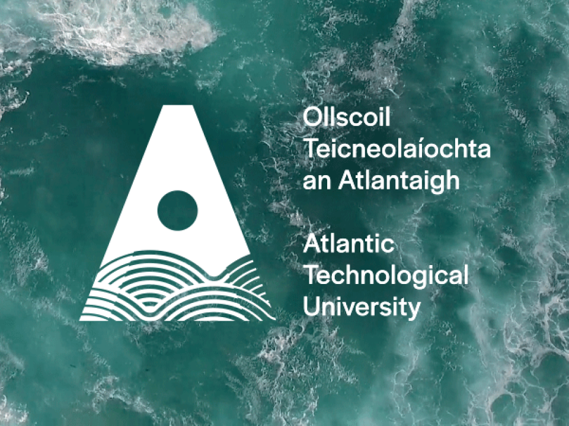

# Data Representation

Author: Ruth Keady 

g00321445@atu.ie
***

## Overview

### Problem statement 
Description:
Write a program that demonstrates that you understand creating and consuming
RESTful APIs. 
Create a Web application in Flask that has a RESTful API, the application
should link to one or more database tables.
You should also create the web pages that can consume the API. I.e. performs
CRUD operations on the data.

Assessment strategy:

Level 1
A rehash of the sample project lab, I will do in
Topic09-linking to db, but with your own data.
I.e.:
1. A basic Flask server that has a
2. REST API, (to perform CRUD operations)
3. One database table and
4. Accompanying web interface, using AJAX
calls, to perform these CRUD operations
40%-45%

Level 2
 more than one database table 45%-50%
Level 3 
 authorization (logging in) 50%-55%

Plus
The web page looks nice. Plus 0- 10%
A more complicated API. Plus 0 – 10%
Server Links to some third party API. Plus 0 - 10%
If the third party API requires authentication. Plus 0-10%
Hosted online (e.g. Azure, Pythonanywhere) Plus 10%

Extra marks for very good projects
To get over 70% your application should be very well laid out, look good and work
efficiently and well.
Project should be well laid out and easy for me to run.
Marks may be deducted for:
• Poorly formatted code, that I find hard to read (Do not over comment your
code),
• If I find it hard to run,
• I find it hard to understand your GitHub layout. (a README file is handy).
______________________________________________________________________________

This repository contains my project submission for the Data Representation module 2022. The purpose of this project is to demonstrate that I have achieved the learning outcomes of the module, which are:
- Create a basic Flask Server
- Rest API with ability to perform CRUD operations
- Create a Database with 2 tables
- Webpage  interface 

***
### DataBases:
1. Login to MySql on your local desktop
2. In a seperate terminal navigate to te downloaded files and run 'python databaseCreate.py'   
3. In the terminal with mySQL open Type Show Databases;>use datarepresentation;>show tables;. You should be able to see jobs and edcuation tables. Use the command 'Select * from <table>' to see the records within each table. 

## Table of Contents

- FOLDERS:
- DATABASE COMMANDS - python scripts to create and update the database content. 
- STATICPAGES - contains html web pages and image folder to support the web interface. 
- README - information on how to run the project. 
- Requirements - what needs to be installed to run the project. 
- SERVER.py - the python script used to start the server. 

***

## Requirements To Run This Project 
In order to run this project on your device please complete the following steps:
- Step 1. Within this repository select the green code button. From the dropdown select download ZIP at the bottom. Unzip the folder on your computer. 
- Step 2. Using your terminal, navigate to the location that the downloaded files were saved.Enter 'python runAPI.py'. Suggest to run the project from a virtual environment. 

### Requirements

To run this project from your local device the following will need to be installed as prerequsites:
  -  Anaconda or a Python environment. [Python Installation Guide](https://docs.anaconda.com/anaconda/install/index.html)
  - Flask [Flask Installation Guide](https://flask.palletsprojects.com/en/2.0.x/installation/)
  - SQL database management system. (mySQL was used to create this project on a MAC OS) [MySQL Installation Guide](https://dev.mysql.com/doc/mysql-installation-excerpt/5.7/en/)
  - The requirements.txt file contained within this repository. From the terminal enter: `pip install -r requirements.txt` in the repo directory.

Alternatively, if you do not wish to install all these packages and files to your local device you can run them in a virtual environment. While in the folder with the repo in your CLI, do the following:

1. Type `python3 -m venv venv` to create a virtual environment (VM).
2. Then `source venv/bin/activate` for MAC or `.\venv\Script\activate.bat` for Windows to open the environment.
3. Then `pip install -r requirements.txt` to install the necessary packages
4. Then enter `python server.py` or 'python3 server.py' depending on what python package you have installed to run the program. 

To exit the VM type deactivate.

## Run API
1. Once the commands above are entered a link to the url will be created : http://127.0.0.1:5000. Open the link and typr /home.html to open the home page. 
2. Navigate through the webpages. 

## Conclusion

## Troubleshooting

***

## Credits

***
